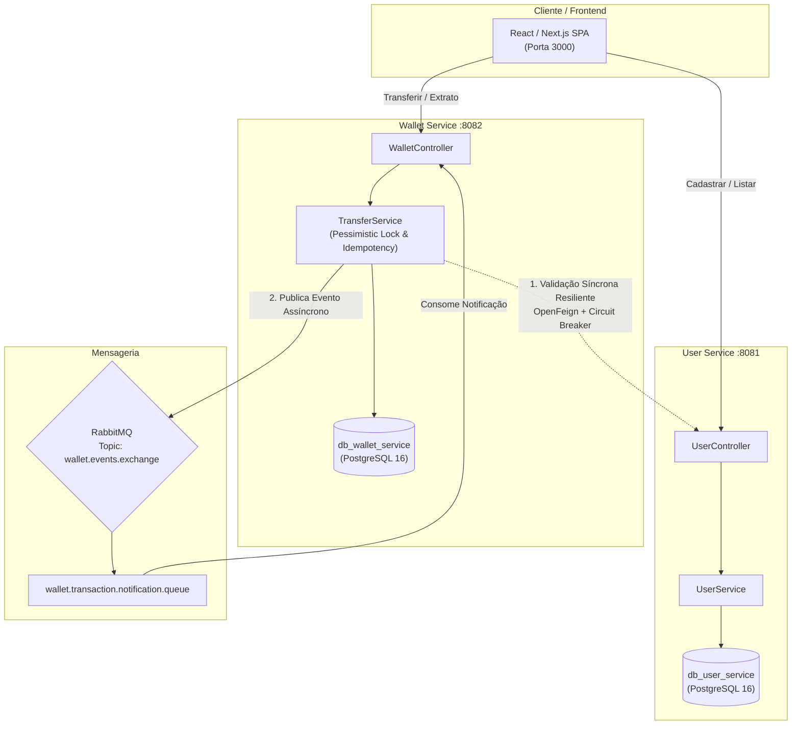

```markdown
# 🏦 Carteira Virtual de Economia Solidária Carnaubanco

> **Projeto de Engenharia Financeira & Microsserviços Resilientes em Java 21 / Spring Boot 3**  
> Focado em práticas reais de arquitetura bancária: concorrência defensiva, idempotência, ledger imutável, mensageria e resiliência.

[](https://www.oracle.com/java/)
[](https://spring.io/projects/spring-boot)
[](https://www.docker.com/)
[](https://www.postgresql.org/)
[](https://www.rabbitmq.com/)

---

## 📌 1. Visão Geral & Contexto de Negócio

Inspirado no modelo pioneiro do **Banco Palmas** (primeiro banco comunitário de desenvolvimento do Brasil), este sistema simula uma plataforma de pagamentos e transferências utilizando **moedas sociais digitais** (*Palmas*).

O ecossistema foi projetado para operar com **alta integridade transacional**, eliminando riscos clássicos de sistemas financeiros distribuídos, como gasto duplo (*double spending*), transações duplicadas em retentativas (*replay attacks*) e falhas em cascata entre serviços.

---

## 🏛️ 2. Arquitetura da Solução

O sistema é dividido em microsserviços autônomos com bancos de dados isolados (*Database-per-Service*), garantindo desacoplamento total e segurança de domínio:



---

## 🛡️ 3. Padrões de Engenharia Financeira Implementados

### 🔒 Prevenção de Gasto Duplo (*Double Spending*)
- **Lock Pessimista de Escrita:** Na execução da transferência, as carteiras de origem e destino são travadas no PostgreSQL via `@Lock(LockModeType.PESSIMISTIC_WRITE)` (`SELECT ... FOR UPDATE`).
- **Prevenção de Deadlock por Ordenação Determinística:** Quando duas transferências concorrentes envolvem as mesmas contas em sentidos opostos (A $\rightarrow$ B e B $\rightarrow$ A), os locks são adquiridos sempre pela ordem alfabética dos seus `UUID`s (`idA.compareTo(idB)`). Isso elimina 100% dos riscos de *deadlock* no banco de dados.
- **Constraint Defensiva a Nível de Banco:** `CHECK (balance >= 0.00)` na tabela SQL, assegurando que o saldo nunca fique negativo mesmo em caso de anomalia de aplicação.

### 🔑 Idempotência Rigorosa
- Transferências financeiras exigem o cabeçalho HTTP `Idempotency-Key` (UUIDv4 gerado pelo cliente).
- Se uma requisição cair por timeout de rede e o usuário reenviar a transação, a chave garante que o débito **não seja executado duas vezes**, retornando o recibo da transação original já processada.

### 📜 Ledger Imutável (*Append-Only*)
- A tabela `transactions` opera como um razão contábil estrito: **não existem operações de `UPDATE` ou `DELETE`**.
- Toda movimentação financeira é gravada de forma atômica com timestamp em UTC e vínculo imutável com as carteiras envolvidas.

### ⚡ Resiliência & Integração Síncrona (Resilience4j + OpenFeign)
- A comunicação entre o `WalletService` e o `UserService` (para verificar se o destinatário está ativo) é protegida por um **Circuit Breaker**.
- **Fallback Semântico:** Tratamento explícito que diferencia um erro de negócio (`404 Not Found` = usuário inexistente) de uma indisponibilidade de infraestrutura (`503 Service Unavailable`), evitando falhas silenciosas.

### 📬 Desacoplamento Assíncrono (RabbitMQ)
- Após a conclusão da transação e commit no banco, o evento `TransactionCompletedEvent` é publicado na *Topic Exchange* `wallet.events.exchange`.
- Consumidores assíncronos processam emissão de extratos, notificações e auditoria sem onerar a latência da requisição HTTP do usuário.

---

## 💻 4. Stack Tecnológica

| Componente | Tecnologias |
| :--- | :--- |
| **Linguagem & Core** | Java 21 (Records, Sealed Interfaces, Pattern Matching) |
| **Frameworks** | Spring Boot 3.x, Spring Data JPA, Spring AMQP, OpenFeign |
| **Resiliência** | Resilience4j (Circuit Breaker, TimeLimiter) |
| **Banco de Dados** | PostgreSQL 16 com migrações versionadas via **Flyway** |
| **Mensageria** | RabbitMQ 3.13 (AMQP + Management UI) |
| **DevOps** | Docker, Docker Compose, Multi-stage builds otimizados |
| **Frontend** | React / Next.js 14, TypeScript, Tailwind CSS |
| **Testes** | JUnit 5, Mockito, Testcontainers |

---

## 🚀 5. Como Executar Localmente

### Pré-requisitos
- [Docker](https://www.docker.com/) e [Docker Compose](https://docs.docker.com/compose/) instalados.

### 1. Clonar o Repositório
```bash
git clone https://github.com/SEU_USUARIO/carteira-virtual-solidaria.git
cd carteira-virtual-solidaria
```

### 2. Subir Toda a Infraestrutura
Com um único comando, o Docker Compose inicializa os bancos PostgreSQL, RabbitMQ, `user-service` e `wallet-service`:
```bash
docker compose up --build -d
```

### 3. Verificar o Status dos Serviços
```bash
docker compose ps
```

| Serviço | Porta Externa | Descrição |
| :--- | :--- | :--- |
| **User Service** | `8081` | API de Usuários e Perfis |
| **Wallet Service** | `8082` | API de Carteiras e Transferências |
| **PostgreSQL** | `5432` | Bancos `db_user_service` e `db_wallet_service` |
| **RabbitMQ UI** | `15672` | Painel Web (`guest` / `guest`) |

---

## 📡 6. Principais Endpoints da API

### User Service (`:8081`)
- `POST /api/v1/users` - Cadastra um novo cidadão/usuário.
- `GET /api/v1/users/active` - Lista os usuários ativos aptos a transacionar.
- `GET /api/v1/users/{id}/active` - Consulta síncrona de status (usada pelo Wallet Service).

### Wallet Service (`:8082`)
- `POST /api/v1/transfers` - Realiza transferência de Palmas (exige `Idempotency-Key` no header).
- `GET /api/v1/wallets/{id}/balance` - Consulta saldo da carteira.
- `GET /api/v1/wallets/{id}/statement?page=0&size=10` - Extrato paginado com histórico imutável.

---

## 🧠 7. Decisões de Otimização & Baixo Custo (DevOps)
- **JVM Memory Tuning:** Configurado `-Xms64m -Xmx128m -XX:+UseG1GC` por container, permitindo que a aplicação completa rode consumindo **menos de 400MB de RAM**, viabilizando deploy em instâncias gratuitas da AWS (`t3.micro`).
- **Segurança de Containers:** Execução sob usuário não-root (`spring:spring`) sobre imagens base ultra-leves `Alpine Linux`.

---

## 📄 Licença
Este projeto está sob a licença MIT. Desenvolvido para fins de estudo e demonstração técnica de engenharia de software para o mercado financeiro.
